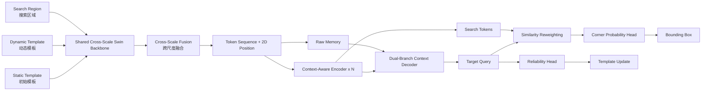

# NexaTrack

**Context-aware cross-scale Transformer tracking for robust visual target localization · 面向鲁棒视觉目标定位的上下文感知跨尺度 Transformer 跟踪框架**

NexaTrack is a complete PyTorch implementation of a single-object visual tracking system built around three components: a cross-scale shifted-window feature extractor, nested context-aware attention for correlation refinement, and a dual-branch Transformer decoder with corner-distribution prediction.

NexaTrack 是一个完整的 PyTorch 单目标视觉跟踪项目，核心由三部分构成：跨尺度移位窗口特征提取网络、用于相关性细化的嵌套上下文感知注意力，以及带角点概率分布预测头的双分支 Transformer 解码器。

> Method provenance is retained in `NOTICE.md`. / 方法来源信息保留在 `NOTICE.md` 中。

## Highlights / 核心特性

- **Cross-scale visual encoding / 跨尺度视觉编码**：three-stage shifted-window backbone fuses intermediate and deep features before tokenization. / 三阶段移位窗口骨干网络融合中层与深层特征后再进行序列化。
- **Nested context-aware attention / 嵌套上下文感知注意力**：the Q-K correlation map is refined by a second attention operation over correlation vectors before the final softmax. / 在最终 softmax 前，对 Q-K 相关图中的相关向量再次执行注意力细化。
- **Gaussian target weighting / 高斯目标加权**：template tokens receive a continuous spatial target mask while search tokens remain unchanged. / 模板区域使用连续高斯目标掩码赋权，搜索区域保持不变。
- **Dual-branch decoding / 双分支解码**：the target query attends to both encoded and pre-encoded feature sequences, then merges the two branches. / 目标查询同时与增强特征序列和原始融合特征序列交互，并聚合两路结果。
- **Corner distribution head / 角点分布预测头**：top-left and bottom-right probability maps are decoded with differentiable expectation. / 预测左上角与右下角概率图，并通过可微期望计算边界框坐标。
- **Dynamic template update / 动态模板更新**：a three-layer reliability head controls online template refresh. / 三层可靠性预测头控制在线动态模板更新。

## Architecture / 架构



## Default configuration / 默认配置

The full configuration uses a 256-dimensional token space, 4 attention heads, 6 encoder layers, 1 decoder layer, a 2048-dimensional FFN, and a 64-dimensional nested correlation descriptor. Input crops are 180×180 for templates and 320×320 for search regions; template images are internally padded/resampled to a 192×192 working size for stable hierarchical window partitioning. The Gaussian target-mask sigma is fixed at `0.05`.

完整配置采用 256 维特征、4 个注意力头、6 层编码器、1 层解码器、2048 维前馈网络以及 64 维嵌套相关描述子。模板裁剪尺寸为 180×180，搜索区域为 320×320；模板在骨干网络内部转换到 192×192 工作尺寸，以保证分层窗口划分稳定。高斯目标掩码的 `sigma` 固定为 `0.05`。

Training defaults use AdamW, backbone/main learning rates of `1e-5` and `1e-4`, weight decay `1e-4`, and a ×0.1 learning-rate drop at epoch 400. Bounding-box optimization combines generalized IoU loss and L1 loss. Loss weights are exposed in YAML because the source specification does not fix their exact values.

默认训练使用 AdamW，骨干网络和其余模块初始学习率分别为 `1e-5` 与 `1e-4`，权重衰减为 `1e-4`，第 400 个 epoch 后学习率衰减为原来的 0.1。边界框损失由 generalized IoU 与 L1 共同组成。由于方法描述未固定两项损失的具体权重，因此本项目将其作为 YAML 可调参数提供。

## Repository structure / 仓库结构

```text
NexaTrack/
├── README.md
├── NOTICE.md
├── LICENSE
├── pyproject.toml
├── requirements.txt
├── configs/
│   ├── nexatrack.yaml
│   └── nexatrack_lite.yaml
├── nexatrack/
│   ├── __init__.py
│   ├── config.py
│   ├── models/
│   │   ├── attention.py
│   │   ├── backbone.py
│   │   ├── head.py
│   │   ├── model.py
│   │   ├── positional.py
│   │   └── transformer.py
│   ├── data/
│   │   ├── transforms.py
│   │   └── triplet_dataset.py
│   ├── engine/
│   │   ├── losses.py
│   │   ├── metrics.py
│   │   └── trainer.py
│   ├── tracking/
│   │   └── tracker.py
│   └── utils/
│       ├── box_ops.py
│       └── checkpoint.py
├── scripts/
│   ├── train.py
│   ├── demo_video.py
│   └── eval_folder.py
├── datasets/
│   └── README.md
├── docs/
│   └── IMPLEMENTATION_NOTES.md
├── tests/
│   ├── test_attention.py
│   └── test_model.py
└── assets/
    └── .gitkeep
```

## Installation / 安装

```bash
git clone <your-repository-url>
cd NexaTrack
python -m venv .venv
# Windows: .venv\Scripts\activate
# Linux/macOS: source .venv/bin/activate
pip install -U pip
pip install -r requirements.txt
pip install -e .
```

For a lower-memory GPU, start with `configs/nexatrack_lite.yaml`. / 显存较小时建议优先使用 `configs/nexatrack_lite.yaml`。

## Dataset format / 数据集格式

Training uses a generic JSONL triplet manifest. Each record contains two template frames and one search frame:

训练使用通用 JSONL 三元组清单，每个样本包含两个模板帧和一个搜索帧：

```json
{
  "static_template": "frames/000001.jpg",
  "dynamic_template": "frames/000008.jpg",
  "search": "frames/000015.jpg",
  "static_bbox": [412, 185, 526, 341],
  "dynamic_bbox": [419, 188, 535, 345],
  "search_bbox": [431, 191, 548, 349]
}
```

Coordinates are absolute `xyxy` values in the original image. Paths can be absolute or relative to the manifest file. See `datasets/README.md` for conversion guidance.

坐标采用原图绝对 `xyxy` 格式。图像路径既可使用绝对路径，也可相对于 manifest 文件填写。转换说明见 `datasets/README.md`。

## Training / 训练

```bash
python scripts/train.py \
  --config configs/nexatrack.yaml \
  --manifest /path/to/train.jsonl \
  --output runs/nexatrack
```

Low-memory profile / 低显存配置：

```bash
python scripts/train.py \
  --config configs/nexatrack_lite.yaml \
  --manifest /path/to/train.jsonl \
  --output runs/nexatrack_lite
```

## Video demo / 视频演示

```bash
python scripts/demo_video.py \
  --config configs/nexatrack.yaml \
  --checkpoint runs/nexatrack/latest.pt \
  --video demo.mp4 \
  --output runs/demo.mp4
```

Select the target once in the first frame. The tracker maintains a static template and a confidence-controlled dynamic template.

首帧框选目标后即可开始跟踪。运行过程中同时维护固定初始模板与由置信度控制更新的动态模板。

## Folder evaluation / 文件夹评估

Expected sequence layout / 序列目录格式：

```text
benchmark/
└── sequence_001/
    ├── img/
    │   ├── 0001.jpg
    │   ├── 0002.jpg
    │   └── ...
    └── groundtruth.txt
```

`groundtruth.txt` uses `x,y,w,h` per line. / `groundtruth.txt` 每行采用 `x,y,w,h`。

```bash
python scripts/eval_folder.py \
  --config configs/nexatrack.yaml \
  --checkpoint runs/nexatrack/latest.pt \
  --root /path/to/benchmark
```

The evaluator reports success AUC and 20-pixel precision. / 评估脚本输出成功率 AUC 与 20 像素精度。

## Core implementation notes / 核心实现说明

The context-aware attention module first computes the ordinary multi-head correlation map `M = QK^T / sqrt(d)`. Each key column of `M` is then treated as a correlation vector, compressed to a low-dimensional descriptor, normalized, transformed into a new Q/K/V triplet, and processed by a nested attention operation. The refined descriptor is expanded back to the original correlation-map resolution and added residually before the outer softmax.

上下文感知注意力首先计算常规多头相关图 `M = QK^T / sqrt(d)`。随后将 `M` 的每个键列视为一条相关向量，压缩为低维描述子并归一化，再生成新的 Q/K/V 执行第二层注意力；细化后的描述子恢复到原相关图尺寸，以残差形式叠加后再执行外层 softmax。

The cross-scale backbone keeps the first three hierarchical shifted-window stages. Stage-2 features are fused with upsampled stage-3 features, projected to the Transformer width, and adaptively pooled to configurable token grids. This keeps the multi-scale representation while bounding encoder memory cost.

跨尺度骨干网络保留前三个分层移位窗口阶段，将第二阶段特征与上采样后的第三阶段特征融合，再投影到 Transformer 通道宽度，并通过可配置自适应池化控制 token 数量，从而在保留多尺度表示的同时限制编码器显存开销。

## Tests / 测试

```bash
python -m compileall nexatrack scripts tests
pytest -q
```

## Scope / 范围说明

This repository supplies the complete model graph, training loop, loss functions, triplet data interface, stateful inference tracker, dynamic template update, video demo, benchmark-style evaluator, and unit tests. Benchmark scores depend on dataset sampling, training duration, augmentation, hardware, and pretrained initialization; no unverified score is claimed here.

本仓库提供完整模型图、训练循环、损失函数、三元组数据接口、状态化推理跟踪器、动态模板更新、视频演示、基准评估脚本与单元测试。最终指标会受到数据采样、训练轮次、数据增强、硬件与预训练初始化等因素影响，因此这里不声明未经实际训练验证的性能数值。
